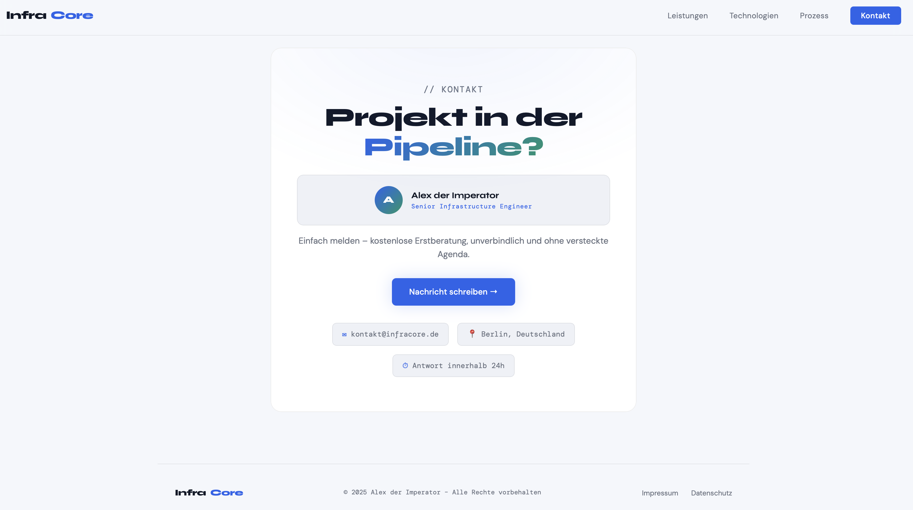

# InfraCore – Virtualisierung & Storage

## Vorschau

Landing Page für IT-Dienstleistungen im Bereich Virtualisierung und Storage.

## Inhalt

- Virtualisierung (VMware, Proxmox, Hyper-V)
- Storage-Lösungen (Ceph, TrueNAS, NetApp)
- Container & Orchestrierung (Docker, Kubernetes)
- Backup & Disaster Recovery
- Monitoring & Betrieb

## Technologie

Reines HTML/CSS/JS – keine Abhängigkeiten, keine Build-Tools.  
Einfach `index.html` im Browser öffnen oder auf einem Webserver ablegen.

## Autor

**Alex der Imperator** – Senior Infrastructure Engineer, Berlin